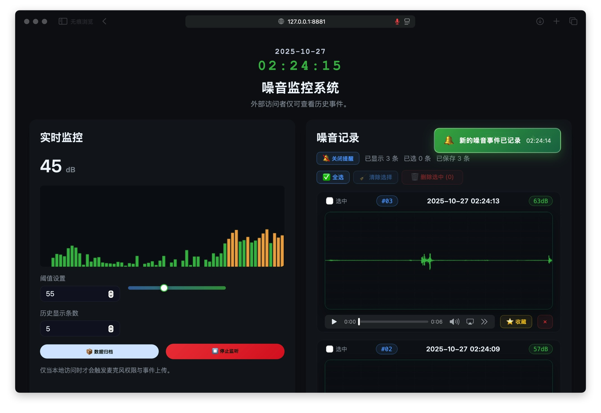
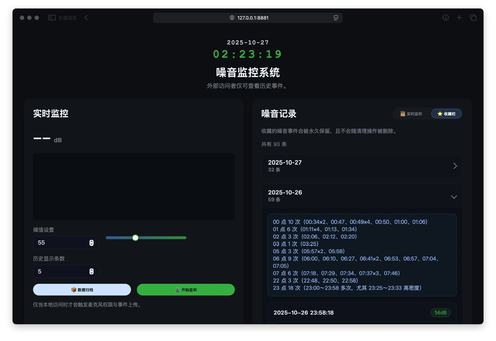
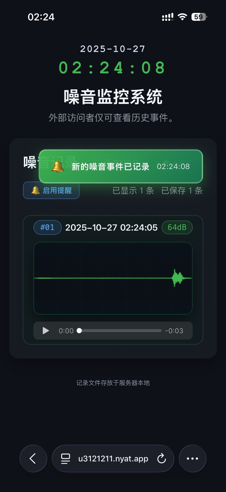
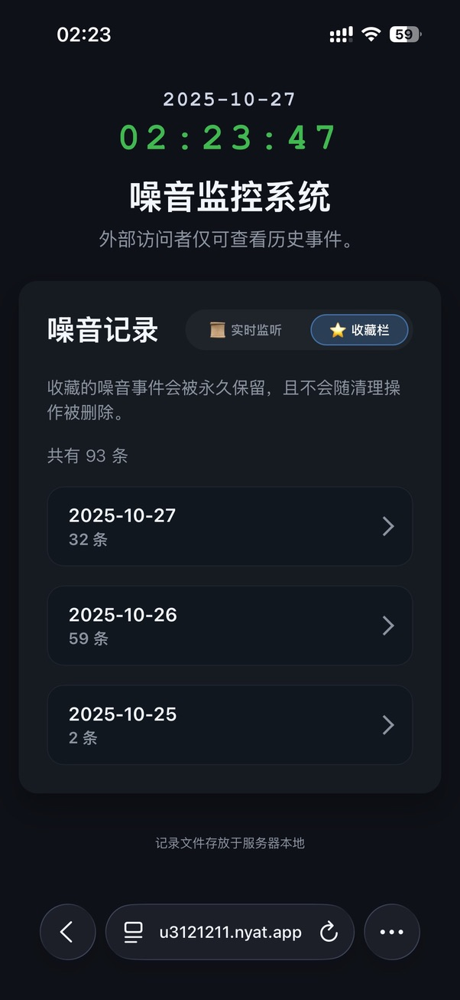

# 噪音监控系统

## 项目简介 😊
噪音监控系统是一套基于 PHP + 原生前端的轻量化工具，可在本地浏览器中实时采集环境噪音、生成音频与波形文件，并提供事件归档与收藏能力，帮助你迅速定位“噪音真凶”，建立可量化的证据链。

## Demo 速览





## 使用须知
- 本项目仅供学习与个人排查使用，严禁用于任何非法或侵犯隐私的场景。
- 系统生成的录音与波形仅作为自我定位、规律分析的参考，不具备法律证据效力。

## 功能亮点
- 实时分贝监测：本地客户端可动态显示噪音值并绘制波形。
- 事件留存：自动保存音频、波形截图与时间戳，支持批量删除与完整归档。
- 收藏与摘要：关键事件可加入收藏，`summary.config.js` 中可编写日期说明。
- 远程只读：非本地访问自动降级为历史浏览模式，保障隐私安全。

## 技术栈
- 后端：PHP 7.4（内置服务器即可运行），严格模式与 JSON API。
- 前端：原生 JavaScript、Canvas 绘图与 Web Audio API。
- 存储：本地文件系统（音频、波形、日志与归档）。

## 真实案例
- 排查阶段：AirPods 开启“实时收听”模式，对比楼道采集与房间内报警，甄别楼上楼下噪音。
- 数据闭环：系统 24 小时监听，一旦分贝异常立即推送通知，与现场听感交叉验证。
- 真相锁定：多次联动保安操作电梯，系统日志与波形记录证明噪音源自电梯机械振动及结构传声。
- 行动指引：整理 `noise_events.log` + 录音波形，向物业提供量化证据，实现精准维权。

## 目录结构
```text
noise_monitor/
├── index.php                # 前端入口与本地访问判定
├── api.php                  # 噪音事件 API
├── assets/
│   ├── app.js               # 浏览器端逻辑
│   └── style.css            # UI 样式
├── favorites/
│   ├── favorites.log
│   ├── recordings/          # 收藏音频
│   └── waveforms/           # 收藏波形
├── recordings/              # 实时录音
├── waveforms/               # 实时波形
├── archives/                # 归档打包输出
├── noise_events.log         # 原始事件日志
└── summary.config.js        # 收藏摘要配置
```

## 快速开始
### 环境要求
- macOS / Linux / Windows，推荐 macOS Sequoia 15.6.1
- PHP 7.4（启用麦克风访问需在浏览器授权）
- Node.js（可选，用于未来前端依赖）


### 本地运行
1. 在项目根目录执行 `php -S 127.0.0.1:8080 -t .`
2. 浏览器访问 `http://127.0.0.1:8080`，按提示授权麦克风。
3. 远程访问者仅能查看历史记录；调试 mutating API 时请保持本地访问。
4. 删除掉 favorites/favorites.log 的 demo 内容
5. 收藏夹的内容无法在界面中删除，只能在 favorites 文件夹中手动删除，请谨慎添加收藏的内容。

### 内网穿透（远程访问）
1. 使用内网穿透 URL，访问域名，即可用手机实时接受通知

### 常用命令
- `php -l api.php index.php`：提交前进行语法检查。
- `npm test`：当前占位命令，CI 将因无测试而失败，落地测试后记得更新脚本。

## 核心接口速览
| 路径 | 方法 | 说明 |
| --- | --- | --- |
| `api.php?action=list` | GET | 获取最近噪音事件，可通过 `limit` 参数控制数量 |
| `api.php?action=log` | POST | 仅本地可用，保存新事件（音频+波形） |
| `api.php?action=delete_many` | POST | 批量删除事件及附属文件 |
| `api.php?action=archive` | POST | 打包所有事件至 `archives/` |
| `api.php?action=favorites` | GET | 拉取收藏事件列表 |

## 数据与安全
- 所有写操作都会验证是否来自本地 IP，切勿移除 `ensureLocalRequest()`。
- 音频、波形文件属于敏感数据，默认被 `.gitignore` 忽略，请勿误传。
- 分享日志前请手动脱敏 `noise_events.log` 中的 IP 与文件名。

## 开发与测试建议
- 修改前端交互后，通过浏览器修改噪音阈值。
- 调整归档流程时，运行一次 `archive` 接口并检视 `archives/` 下的压缩包结构。
- 修改收藏摘要后，刷新收藏标签页确认 `summary.config.js` 的新文案生效。

## 常见排查技巧
- 联合监听：楼道实时听音 + 房间系统推送对照，提高定位准确率。
- 分段复核：关注系统标记的高频时段（如 6:00-9:00、19:00-20:00、22:00-02:00），与邻居作息或设备运行时间做比对。
